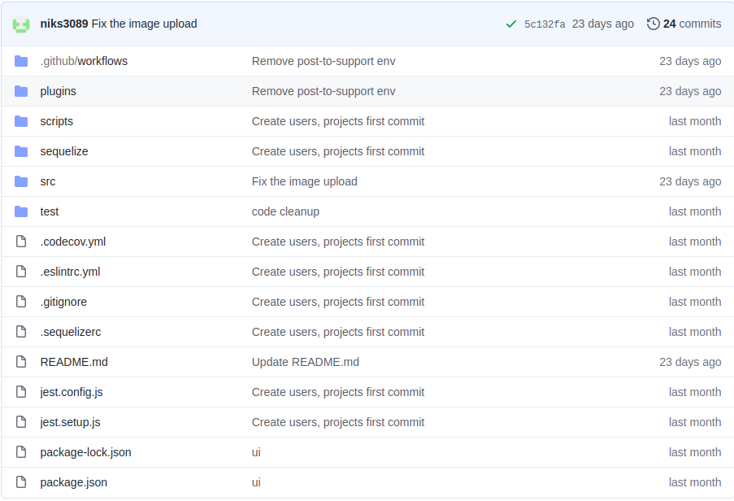
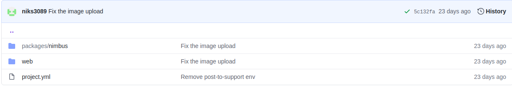
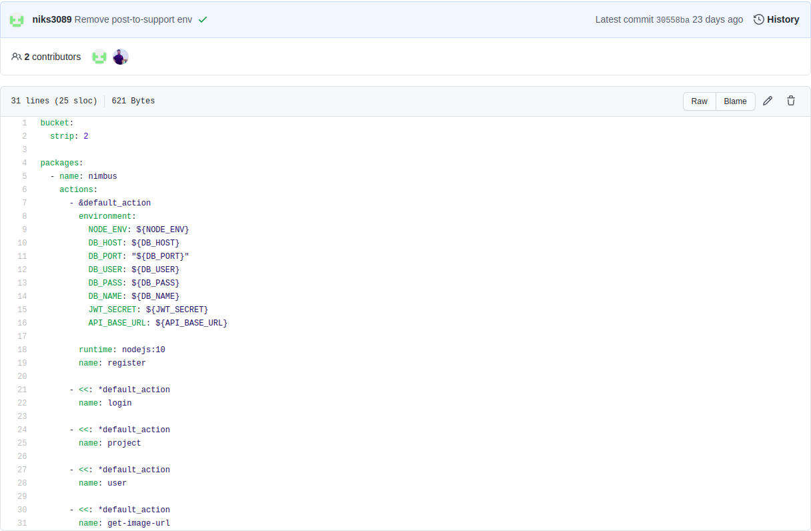
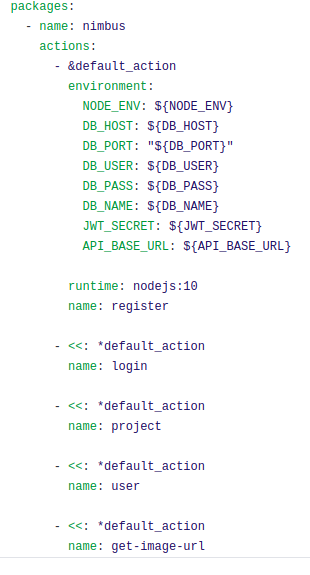
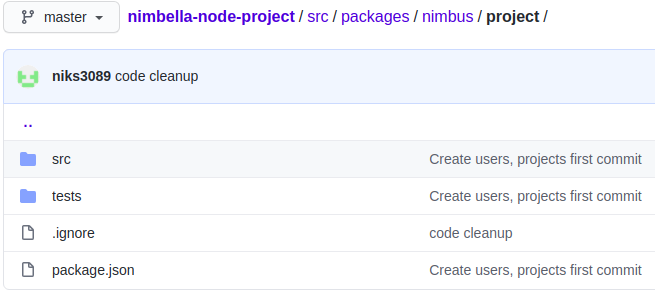
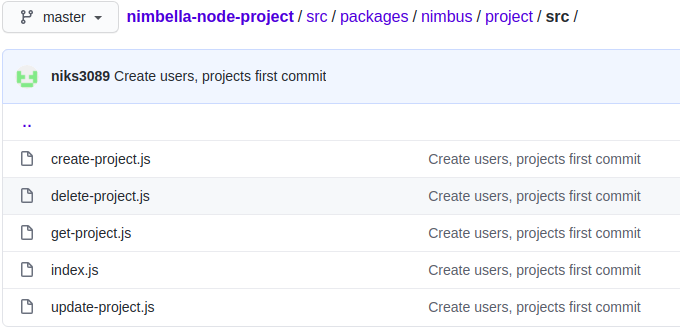
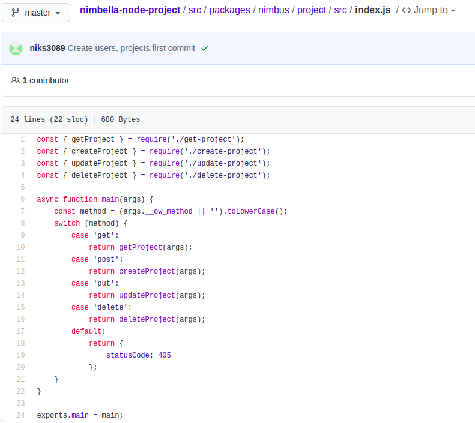

import Tabs from '@theme/Tabs';
import TabItem from '@theme/TabItem';

## Project

You have come so far, Now it's time to take a look at the [sample project](https://github.com/niks3089/nimbella-node-project) which will help us understand how to build serverless API.

Let's get started!

### Project Overview

This project aims to demonstrate the REST operations. Therefore, we will only focus on the API portion for now.

The image below shows the project structure for this node app. As we know, `Package.json` will contain all the project commands and dependencies for the project and we can put our test cases under `test` folder.

As logically `src` folder should contains all the actual program code, Therefore we have added all the front-end and back-end code there.



Now, As you know in order to follow the `Nimbella` project structure we have to add front-end code under `web` folder and back-end code under `packages` folder. We have also added `project.yml` file which allows us to configure the project ***we will talk about this in details soon.***



### Creating packages

Nimbella allows us to create different packages which helps in easier code separation. In order to do this we need to configure our `project.yml`. Let's see how.



As shown in the image above. We have to define the package name we want to create under `package`.
Now, we need to create a folder with the same name under `packages` folder.


### Creating actions

Actions contains the actual code that will be called for the execution. Let's see how we can create them.

The process of creating action is similar to packages but with some extra features.



Let's see what the above image is trying to tell use.

`&default_action`, Means this will be called with all the actions. Hence this is the better place for specifying some default values like we have specified `environment` values ***more on this later!***

Each action should have a unique `name` and we can attach `&default_action` with it if required.
Till now, We have successfully configured our `project.yml`. Now, its time to create the actions we have specified in the config.

Each folder should be named the same as the action specified in the `config` file and should contain `src/index` file with in it (`index.js` in case of node project).

Each index file should have a `main` function which will act the start of the program. As, upon calling these actions the main function present inside the index file will be triggered.

Here is what the actual action structure and code looks like!




Now, Let's check the main function and how we can check the calling method based on which we can do code separation in our program.

<!--  -->
<Tabs
  defaultValue="js"
  values={[
    {label: 'Javascript', value: 'js'},
    {label: 'Python', value: 'py'},
    {label: 'Go', value: 'go'},
  ]}
  >
  <TabItem value="js">

```
const { getProject } = require('./get-project');
const { createProject } = require('./create-project');
const { updateProject } = require('./update-project');
const { deleteProject } = require('./delete-project');

async function main(args) {
    const method = (args.__ow_method || '').toLowerCase();
    switch (method) {
        case 'get':
            return getProject(args);
        case 'post':
            return createProject(args);
        case 'put':
            return updateProject(args);
        case 'delete':
            return deleteProject(args);
        default:
            return {
                statusCode: 405
            };
    }
}

exports.main = main;

```

  </TabItem>
  <TabItem value="py">

```
NEED TO CONVERT THIS FUNCTION IN PYTHON

```

  </TabItem>
  <TabItem value="go">

```
NEED TO CONVERT THIS FUNCTION IN GO

```

  </TabItem>
</Tabs>

## Taking an example project, we go through
## Creating packages
## Creating Actions
## Package.json and where to place them
## .env
## Sharing code between actions
## Adding packages to your actions
## Example on using redis/buckets
## How to debug your functions
## How to deploy your functions while developing
## Watching your project
## Fetching logs and activations
## Multiple stages of development/testing
## Testing your functions locally with express and jest
## Writing tests
## Taking your project to production
## Setting up CI/CD using github
